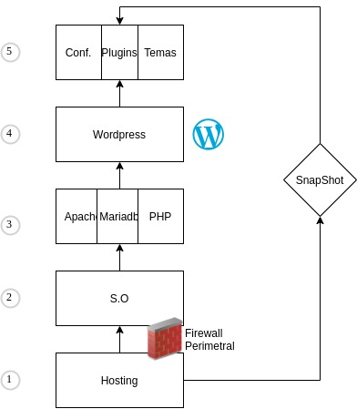

- [1. Diagrama de seguridad en wordpress](#1-diagrama-de-seguridad-en-wordpress)
- [2. Acciones sobre ficheros de nuestro servidor](#2-acciones-sobre-ficheros-de-nuestro-servidor)
  - [2.1. Permisos sobre ficheros](#21-permisos-sobre-ficheros)
  - [2.2. Proteger el panel de administración](#22-proteger-el-panel-de-administración)
  - [2.3. Eliminar el archivo install.php](#23-eliminar-el-archivo-installphp)
  - [2.4. Cambiar el prefijo de las tablas de wordpress](#24-cambiar-el-prefijo-de-las-tablas-de-wordpress)
  - [2.5. Bloquear el listado de directorios](#25-bloquear-el-listado-de-directorios)
  - [2.6. Protección frente a los hotlinks](#26-protección-frente-a-los-hotlinks)
  - [2.7. Eliminar los meta tag de la version de wordpress](#27-eliminar-los-meta-tag-de-la-version-de-wordpress)
  - [2.8. Proteger el archivo htaccess](#28-proteger-el-archivo-htaccess)
- [3. Plugin para mejorar la seguridad](#3-plugin-para-mejorar-la-seguridad)
  - [3.1. Repositorio para plugins](#31-repositorio-para-plugins)
  - [3.2. A nivel de .htaccess](#32-a-nivel-de-htaccess)
    - [3.2.1. All in one WP Security & Firewall](#321-all-in-one-wp-security--firewall)
    - [3.2.2. iThemes Security](#322-ithemes-security)
  - [3.3. A nivel de wordpress](#33-a-nivel-de-wordpress)
    - [3.3.1. Wordfence Security – Firewall & Malware Scan](#331-wordfence-security--firewall--malware-scan)
    - [3.3.2. Shield](#332-shield)
    - [3.3.3. **Acunetix WP security**](#333-acunetix-wp-security)
  - [3.4. WAF - Web Application Firewall](#34-waf---web-application-firewall)
    - [3.4.1. NinjaFirewall (WP Edition) – Advanced Security](#341-ninjafirewall-wp-edition--advanced-security)
  - [3.5. ModSecurity](#35-modsecurity)
  - [3.6. Varios Plugin](#36-varios-plugin)
- [4. Protocolo de actuación en caso de emergencia](#4-protocolo-de-actuación-en-caso-de-emergencia)
- [5. Ayuda para webmasters: sitios comprometidos de Google](#5-ayuda-para-webmasters-sitios-comprometidos-de-google)
- [6. Buscar Vulnerabilidades en nuestro sitio](#6-buscar-vulnerabilidades-en-nuestro-sitio)
- [7. Backup de wordpresss](#7-backup-de-wordpresss)
- [8. Registro de la propiedad](#8-registro-de-la-propiedad)
- [9. Buscar copias o plagios](#9-buscar-copias-o-plagios)
- [10. Web sobre seguridad wordpress](#10-web-sobre-seguridad-wordpress)
- [11. Monitorizar registros](#11-monitorizar-registros)

# 1. Diagrama de seguridad en wordpress



# 2. Acciones sobre ficheros de nuestro servidor

## 2.1. Permisos sobre ficheros

Todos los archivos deben ser **propiedad** de la cuenta de usuario y además debes poder escribirlos. 

Los archivos que necesiten acceso de escritura desde Wordpress debe ser editable por el servidor web(apache)


Para cambiar los permisos de los directorios

Dará permisos de Lectura,escritura y ejecución al usuario, y lectura y ejecución a grupos y otros

```
find /ruta/de/tu/wordpress/ -type d -exec chmod 755 {} \;
```

Para los archivos:

Dará permisos de lectura y escritura al usuario y solo lectura para grupos y otros.

```
find /ruta/de/tu/wordpress/ -type f -exec chmod 644 {} \;
```
## 2.2. Proteger el panel de administración 

Para impedir que se pueda acceder al panel de administración desde otro lugar que no se nuestra oficina, podemos añadir una regla en el fichero `.htaccess` dentro de la carpeta wp-admin con el siguiente contenido:

```
order deny,allow
deny from all
allow from x.x.x.x
allow from x.x.x.x
```

## 2.3. Proteger la carpeta wp-admin con contraseña

Si queremos que nuestro panel de administracion sea accesible desde cualquier sitio podemos bloquearlo mediante contraseña utilizando `htpasswd` y creando la siguiente regla para permitir los archivos necesarios.

```config
AuthUserFile .htpasswd
AuthType Basic
AuthName "Mi área restringida"
Require valid-user

# Exclude the files ajax, upload and WP CRON scripts from authentication
<FilesMatch "(admin-ajax\.php|media-upload\.php|async-upload\.php|wp-cron\.php|xmlrpc\.php)$">
  Order allow,deny
  Allow from all
  Satisfy any
</FilesMatch>
```

En el fichero htpasswd añadiremos el resultado que nos de al generarlo en la siguiente web [generardor htpassd](https://hostingcanada.org/htpasswd-generator/) 

`sergio:$22310$OHs23u5hCE1sad2awAQMbePasd3Hgi7g5cfsamCfxwt0FxZK.i`


## 2.4. Eliminar el archivo install.php
En la carpeta wp-admin se crea cada vez que se aplica una instalación nueva

Como este archivo se crea cada vez que aplica una actualización, podemos bloquearlo mediante el archivo `.htaccess`

Dentro de la carpeta `wp-admin` creamos el archivo con el siguiente contenido:

```config
# PROTEGE install.php
<Files install.php>
 Order Allow,Deny
 Deny from all
 Satisfy all
</Files>

```

## 2.5. Cambiar el prefijo de las tablas de wordpress

1. Editar el archivo wp-config.php

En el archivo «wp-config.php», buscamos la línea `table_prefix  = 'wp_'` y la cambiamos por `$table_prefix  = 'otracosa';`.

2. Renombar las tablas

```sql
RENAME table wp_aiowps_events TO otracosa_aiowps_events;
RENAME table wp_aiowps_failed_logins TO otracosa_aiowps_failed_logins;
RENAME table wp_aiowps_global_meta TO otracosa_aiowps_global_meta;
RENAME table wp_aiowps_login_activity TO otracosa_aiowps_login_activity;
RENAME table wp_aiowps_login_lockdown TO otracosa_aiowps_login_lockdown;
RENAME table wp_commentmeta TO otracosa_commentmeta;
RENAME table wp_comments TO otracosa_comments;
RENAME table wp_links TO otracosa_links;
RENAME table wp_options TO otracosa_options;
RENAME table wp_postmeta TO otracosa_postmeta;
RENAME table wp_posts TO otracosa_posts;
RENAME table wp_terms TO otracosa_terms;
RENAME table wp_term_relationships TO otracosa_term_relationships;
RENAME table wp_term_taxonomy TO otracosa_term_taxonomy;
RENAME table wp_usermeta TO otracosa_usermeta;
RENAME table wp_users TO otracosa_users;
RENAME table wp__wsd_plugin_alerts TO otracosa__wsd_plugin_alerts;
RENAME table wp__wsd_plugin_live_traffic TO otracosa__wsd_plugin_live_traffic;
RENAME table wp__wsd_plugin_scan TO otracosa__wsd_plugin_scan;
RENAME table wp__wsd_plugin_scans TO otracosa__wsd_plugin_scans;
```

3. Buscar otras tablas que tengan como valor "option name" el contenido wp

```sql
SELECT * FROM otracosa_options WHERE option_name LIKE "%wp_%";
```
4. Buscar en la tabla usermeta las meta_key que tenga wp y cambiarlas

```sql
SELECT * FROM otracosa_usermeta WHERE meta_key LIKE "%wp_%";
```

También se puede utilizar un plugin que nos permite hacer todo esto de forma automática:

- [Change db prefix](https://es.wordpress.org/plugins/brozzme-db-prefix-change/)
- WebsiteDefencer wordpress security

## 2.6. Bloquear el listado de directorios

Añadir un archivo llamado index.php  en cada uno de los directorios rincipales con el código.

```
<?php
?>
```

También lo podemos hacer añadiendo el siguiente texto al archivo `.httaccess`. Esto evitara que se puedan listar los directorios.

```
Options All –Indexes
```


## 2.7. Protección frente a los hotlinks

Los hotlinks consiste en cuando alguien enlaza una imagen desde nuestra web a su página web, de forma que consume recursos de nuestro servidor, pero se muestra en su web.

Debes renombrar donde aparece sergiosoriano.es por la dirección de tu web.

También debes subir una imagen con nombre `NO_AL_HOTLINKING.jpg` en el directorio raiz de tu página web.


```config
RewriteCond %{HTTP_REFERER} !^$
RewriteCond %{HTTP_REFERER} !^http://sergiosoriano.es$ [NC]
RewriteCond %{HTTP_REFERER} !^http://sergiosoriano.es/.*$ [NC]
RewriteCond %{HTTP_REFERER} !^http://www.sergiosoriano.es$ [NC]
RewriteCond %{HTTP_REFERER} !^http://www.sergiosoriano.es/.*$ [NC]
RewriteCond %{HTTP_REFERER} !^http://www.feedburner.com/.*$ [NC]
RewriteCond %{HTTP_REFERER} !^http://feeds.feedburner.com/sergiosoriano.es$ [NC]
RewriteCond %{HTTP_REFERER} !^http://www.planetaki.com/.*$ [NC]
RewriteCond %{HTTP_REFERER} !^http://[^/.]\.bloglines\.com$ [NC]
RewriteCond %{HTTP_REFERER} !^http://www.google.com/reader/view/.*$ [NC]
RewriteCond %{HTTP_REFERER} !^http://www.google.com/reader/m/view/.*$ [NC]
RewriteRule .*\.(gif|jpg|jpeg|png|bmp)$ http://sergiosoriano.es/NO_AL_HOTLINKING.jpg [R,NC,L]
```

## 2.8. Eliminar los meta tag de la version de wordpress

En el archivo `functions.php`  dentro de la carpeta de nuestro temas tenemos que añadir al final las siguientes lineas

```php
// Eliminamos la versión de WP y los metadatos
remove_action( 'wp_head', 'wp_generator' ) ;
remove_action( 'wp_head', 'wlwmanifest_link' ) ;
remove_action( 'wp_head', 'rsd_link' ) ;
````

## 2.9. Proteger el archivo htaccess

Para proteger el archivo debemos añadir el siguiente contenido al fichero `.htaccess`

```config
<files .htaccess>
order allow,deny
deny from all
</files>
```


# 3. Plugin para mejorar la seguridad

Si en vez de modificar de forma manual todos estos ficheros, aunque posiblemente perdamos algo de rendimiento en nuestro sitio, podemos utilizar algunas de las siguientes extensiones.

## 3.1. Repositorio para plugins

- https://es.wordpress.org/plugins/</b>
- https://fooplugins.com/
- https://www.appthemes.com/
- https://wpappstore.com/  - Web que al registrarte te envía correos con nuevos plugins con garantía

## 3.2. A nivel de .htaccess

### 3.2.1. All in one WP Security & Firewall

[All in one WP Security & Firewall](https://es.wordpress.org/plugins/all-in-one-wp-security-and-firewall/) : Esta extensión nos permite centralizar todas las opciones anteriores, como desventaja diríamos que si hay un fallo en este plugin se pueden ver afectadas todas las áreas. Antes de hacer ninguna modificación con este plugin conviene hacer un backup de toda nuestra página, a ser posible a nivel de ficheros.

En el enlace de la extensión puedes encontrar todas las características, pero podemos destacar las siguientes:

- Detecta ataques en nuestro wordpresss
- Manejo de la creación de cuentas de usuarios
- Registro de usuarios en el cortafuegos
- Protección de los ficheros del sistema
- Protección de autentificación
- Protección de cortafuegos frente al Spam
- Monitorizar los cambios en ficheros

### 3.2.2. iThemes Security

https://es.wordpress.org/plugins/better-wp-security/

## 3.3. A nivel de wordpress

Estos plugin actuan antes de cargar la web e intenta filtrar los ataques a medida que Wordpress se esta cargando.

### 3.3.1. Wordfence Security – Firewall & Malware Scan

https://es.wordpress.org/plugins/search/wordfence/

### 3.3.2. Shield

https://wordpress.org/plugins/wp-simple-firewall/


### 3.3.3. **Acunetix WP security**

- Comprueba los permisos de los archivos de wordpress
- Esconde la version de tu wordpress
- Elimina los errores de login, para evitar que se pueda reconocer el usuario cuando se intentan accesos.
- Esconde notificaciones de actualizaciones para usuarios que no son administradores
- Permite ver en tiempo real los usuarios conectados a tu web (Live Traffic)
- Escanea nuestro sitio en busca de Vulnerabilidades

## 3.4. WAF - Web Application Firewall

A diferencia de los Firewall tradicionales que supervisan el trafico a nivel de red, los WAF o Firewall de Aplicaciones Web puede supervisar, filtrar o bloquear el tráfico http hacia y desde una web trabajando sobre la capa 7.

Los WAF nos pueden proteger de ataques como:

- Inyección SQl
- XSS - Cross-site scripting 
- CSRF - Falsificación de petición de sitios cruzados.

### 3.4.1. NinjaFirewall (WP Edition) – Advanced Security

https://es.wordpress.org/plugins/ninjafirewall/


## 3.5. ModSecurity

https://modsecurity.org/


## 3.6. Varios Plugin

### 3.6.1. Para impedir registros automáticos

En caso de que tengamos habilitar el registro de nuevos usuarios es conveniente tener instalado un puligun que evita que se puedan registrar de forma autoamática.

`Stop Spammers`

### 3.6.2. Cambiar la url de acceso a administración

`HC Custom WP-Admin-url`

### 3.6.3. Accedemos a los ajustes desde:

`Ajustes -> Enlaces permanentes -> slug Admin`

### 3.6.4. Monitorizar todo lo que se hace en wordpress

`PlainView Activity Monitor`

Mantener los plugin actualizados

`Easy Updates Manager`


# 4. Protocolo de actuación en caso de emergencia

- Mantener la calma.
- Escanear el equipo.
- Consultar al soporte de nuestro hosting.
- Cambiar todas las contraseñas (wp-config,shh, ftp, correo, usuarios wordpress).
- Cambiar códigos de autenticación del fichero wp-config.
- Desactivar los plugin y temas.
- Realizar un backup.
- Editar el archivo .htaccess y buscar cambios, y asegurar los permiso 0644.
- Restaurar el sistema.

# 5. Ayuda para webmasters: sitios comprometidos de Google

Google dispone de una pagina web con información y ayuda para resolver problemas en caso de haber sido hackeado.

 	https://www.google.com/webmasters/hacked/?hl=es

# 6. Buscar Vulnerabilidades en nuestro sitio

- Plugin para chrome: IP Address and domain information
- https://hackertarget.com/wordpress-security-scan/
- http://sqlmap.org/
- https://beefproject.com/

# 7. Backup de wordpresss

Uno de los plugin mas sencillo para realizar un backup y restaurar nuestra pagina de wordpress es **All-in-One WP Migration**

https://es.wordpress.org/plugins/all-in-one-wp-migration/


# 8. Registro de la propiedad

España: http://www.culturaydeporte.gob.es/cultura/propiedadintelectual/registro-de-la-propiedad-intelectual.html

Madrid: https://www.comunidad.madrid/gobierno/informacion-juridica-legislacion/registro-territorial-propiedad-intelectual

[SaveCreative](https://www.safecreative.org/)

[CreativeCommons](https://creativecommons.org/licenses/?lang=es_ES)

# 9. Buscar copias o plagios

- [Plagium](https://www.plagium.com/) - Busca plagios a partir de un texto
- [copyscape](https://www.copyscape.com/) - Nos permite buscar si el contenido de nuestra web aparece en otra paginas.
doccop para


# 10. Web sobre seguridad wordpress

- [Hardering Wordpress](https://wordpress.org/support/article/hardening-wordpress/)


# 11. Monitorizar registros

**OSSCEC** es un sistema de detección de intrusiones basado en host de código abierto, o en ingles `Host-based Intrusion Detection System (HIDS)`
 Realiza análisis de registros, verificación de integridad, monitoreo del registro de Windows, detección de rootkits, alertas en tiempo real y respuesta activa. Se ejecuta en la mayoría de los sistemas operativos, incluidos Linux, OpenBSD, FreeBSD, Mac OS X, Solaris y Windows.  

- [Documentación](https://www.ossec.net/docs/)

Los objetivos del seguimiento del sistema de archivos incluyen:

- Supervisar archivos modificados y agregados
- Registrar cambios y adiciones
- Capacidad para revertir cambios granulares
- Alertas automatizadas


# 12. Enlaces

[Checklist](https://github.com/RafaelFunchal/wordpress-security-checklist/blob/master/items.es.md) 
